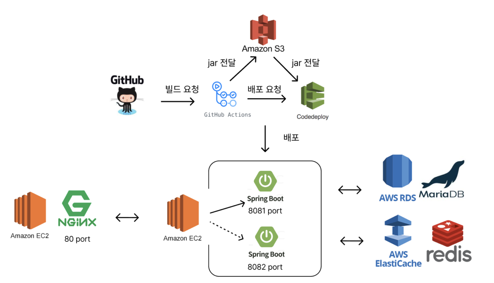

# 예약 시스템
- 영화, 뮤지컬, 클래식 공연 등의 좌석 예약 서비스를 제공하는 웹 애플리케이션
- 성능 병목 분석부터 인프라 구성까지 전반을 다루며 3단계에 걸쳐 점진적으로 개선
- SKILL
    - 개발: Spring Boot, JPA, JUnit5, MariaDB, H2, Redis
    - 인프라: AWS EC2, AWS RDS, AWS CodeDeploy, AWS S3
    - 기타: Git, Intellij, DBeaver, nGrinder

- 아키텍처

## Postman API Docs

- https://documenter.getpostman.com/view/15521816/2sA35A6QEr

### 1차 개발
- Spring Framework 기반으로 진행하며, 직접 Configuration 클래스를 통해 Bean 간의 관계를 설정함으로써 DI 대한 이해 
- 외부 Tomcat 환경에서 리소스 반영 지연 및 기동 오류를 경험하여, 더 안정적인 배포 환경을 위해 Spring Boot로 전환,  Spring → Spring Boot (4.3 → 2.7)

### 2차 개발
- 반복 SQL문과 변경이 잦은 설계로 인해 JdbcTemplate에서 JPA로 변경
- 이상 현상 방지를 위해 ERD 재설계
    - 관람 좌석 등급 기능을 추가하며 관람 장소 좌석 테이블의 N:M 관계를 1:N 관계를 분리
- 인기 예약 상품 조회에 Local Cache(Thread Safe 자료구조)를 통해 API 응답속도 85% 향상
- 100건 동시 예약 요청에서도 데이터 무결성을 보장하도록 동시성 제어
  - synchronized로 한 스레드씩 처리하려 했지만,
  - JPA는 flush와 커밋 타이밍이 분리되어 WAS의 동기화와 DB 반영 시점이 일치하지 않는 경우 발생 (100건 중 약 94건 통과)
  - **필요한 데이터에만 동시성 문제를 세밀하게 제어하기 위해 Pessimistic Lock 적용하여 동시성 제어**

### 3차 개발
- Github Action + AWS S3 + CodeDeploy 환경으로 CI/CD 무중단 배포 도입
- 통합 테스트에서 @DirtiesContext 로 인한 시간 지연을 개선하기 위해 @sql 활용, **테스트 시간 12초 → 9초 개선**
- **vUser 100명 기준** 부하 테스트를 진행하여 성능 개선
    - 2Core, 4GB 사양의 AWS EC2, RDS 서버에서 **100만건 더미 데이터 활용**
    - **TPS 1.7 → 27.6 약 23배 증가**
      - **cursor 기반 페이징 및 커버링 인덱스, redis 등을 도입하여 db 부하 감소 및 성능 최적화**
    - Redis Warm-up 지연 원인을 Redisson addAll() 호출 방식에서 찾아, Lua Script를 활용한 일괄 삽입 방식으로 성능 병목을 해결(22분 → 12초)
<!--
## ERD 

### 테이블 
1. category
    - 제품의 카테고리(클래식, 뮤지컬, 전시 등)
2. product
    - 제품 소개 및 정보
3. product_price
    - 제품 (좌석별) 가격
        - 예) A 콘서트 R석 1만원 / VIP 석 2만원
4. product_seat_schedule
    - 제품의 예약 시간과 총 예약 수량
        - 예) A 콘서트 24.1.1일자 1시에 R석 총 10석 예약 
5. place
    - 관람 장소  
    - 관람 장소의 좌석 수, 좌석 종류, 주소
6. member
    - 사용자 정보 
7. reservation
    - 사용자 예약 정보 
8. reservation_price
    - 예약 시 가격과 좌석 종류 

## 최적화 

### 1-1. 인메모리 캐싱 속도 개선
#### 구조

#### 다이어그램

- Product을 Group by를 통해 매번 예매 순서에 따라 정렬된 상태로 조회하는 것은 DB에 부담을 주게 된다. 
- 따라서 실시간 인기 product를 캐싱하여 DB 부하를 줄이고 응답을 빠르게 처리하도록 캐싱한다.
    - 사용자가 요청 시 DB를 거치지 않고 메모리에서 빠르게 조회가 가능하게 된다. 

### 1-2. 예약/예약 취소 시 로컬 캐시에 반영

- 캐시는 정렬된 상태를 유지하고 있기 때문에 product의 예약/예약 취소 시 insertion sort로 재정렬하여 디비 조회 요청을 줄일 수 있다.

### 1-3. 응답 속도 비교

- 환경
    - product 데이터 10000건
    - product_seat_schedule 데이터 10000건 (예약 수 정보)

- 캐싱 적용 전 응답 속도: 약 90ms
---  

- 캐싱 적용 후 응답 속도: 약 14ms
- 응답 속도가 90ms에서 14ms로 빨라졌을 때 성능은 약 84.44% 향상
    - 기준: Improvement Percentage Formula
    - 성능 향상(%) = (이전 응답 시간 - 현재 응답 시간 / 이전 응답 시간)* 100  

### 1-4. 장단점  
  
- 장점 
    - 디비를 거치지 않아도되어 빠르게 조회가 가능하다. 
- 단점 
    - 다중 was 서버 구조가 된다면 예약/예약 취소 시 캐시에 반영이 어려워 캐시 서버를 두는 것같은 다른 방법이 필요하다. 

코드: https://github.com/hj0328/Reservation-System/commit/68cedcee0a95852618e0ad7fd01aeac8761de356

### 2. 동시성 문제 해결 - Pessimisitc Lock

- 예약 시스템 특성상 다수의 고객이 동시에 예약 요청을 할 수 있기 때문에 동시에 예약 요청이 들어와도 안전한 처리가 필요

- 테스트 결과 다수의 사용자가 동시에 상품 예약 시 총 예약 좌석 수가 제대로 계산되지 않는 현상 

 

- 예약 요청 로직은 위와 같다. 

- 동시 요청이 들어왔을 때 4, 5번째 로직에서 동시성 문제 발생 
- 따라서 4번 조회 로직은 먼저 실행된 트랜잭션의 update 요청 이후에 수행되어야 한다. 

- 비관적 락(pessimistic lock)을 이용하여 DB 테이블에 락 거는 방법을 변경한다.
- 4번 로직에서 테이블 row를 조회할 때 쓰기와 같은 수준의 Exclusive Lock을 건다.
- 그러면 이전 트랜잭션의 update 요청이 끝나야 4번 로직에서 lock 을 얻어 작업을 수행할 수 있다.

### 2-1. 장단점  
  
- 장점 
    - 디비를 거치지 않아도되어 빠르게 조회가 가능하다. 
- 단점 
    - 다중 was 서버 구조가 된다면 예약/예약 취소 시 캐시에 반영이 어려워 캐시 서버를 두는 것같은 다른 방법이 필요하다. 

--> 
